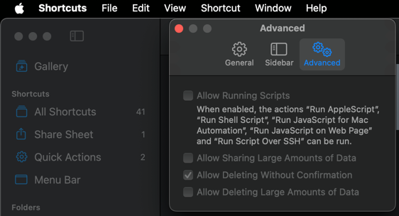

# macos-clipboard-manager
Clipboard manager for macOS using [Shortcuts](https://apps.apple.com/us/app/shortcuts/id1462947752)

# Setup Instructions
1. Import both shortcuts into the shortcuts app and complete the initial setup as directed. (Download the .shortcut files and double click them to import)
2. Save insert-to-clipboard.command. Open terminal in directory where this file is saved and run the following command. ```chmod 755 insert-to-clipboard.command```
3. Assign a keyboard shortcut for running the GetFromClipboard [Check Run a shortcut from a keyboard shortcut in this guide from Apple](https://support.apple.com/guide/shortcuts-mac/launch-a-shortcut-from-another-app-apd163eb9f95/mac).
4. Check Allow Deleting Without Confirmation in Shortcuts App settings (Required for clearing history. If not granted you will prompted to clear the history each time)

5. For the first time each shortcut is run it will ask for permissions. Click on Always Allow.

# Permissions required and why
Below are the list of permissions the shortcuts will ask for when run and why
1. AddToClipboard will ask for permission to save a file. This file is being used to store the history.
2. AddToClipboard will ask for permission to delete file when the history exceeds the limit set. This is required to clear history.
3. GetFromClipboard will ask for permission to access clipboard. This is for copying the chosen history item to clipboard.
4. The insert-to-clipboard.command runs the AddToClipboard shortcut in a loop with a 2 second sleep timer. This is to allow adding to history seamlessly. You can choose to skip using insert-to-clipboard.command and assign a keyboard shortcut to AddToClipboard instead, to add items on demand.
5. It is best to select Always Allow for all permissions to avoid additional input each time the functionality is used.